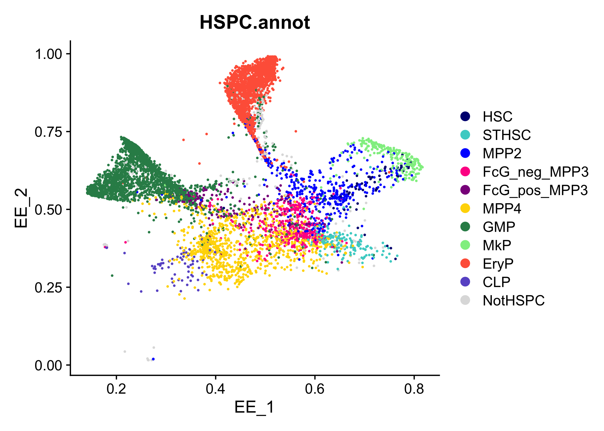

<!-- README.md is generated from README.Rmd. Please edit that file -->

# HemaScribe

<!-- badges: start -->
<!-- badges: end -->

This package contains two main functions to analyze single cell
RNA-sequencing data from the mouse hematopoietic system: HemaScribe and
HemaScape. HemaScribe annotates cell types in the mouse bone marrow with
a focus on hematopoietic stem and progenitor cells (HSPCs). It performs
multilevel annotation using a hierarchy of classifiers trained on
publicly available bulk RNA-sequencing data and newly generated
single-cell RNA-sequencing data. HemaScape performs trajectory analysis
by mapping query cells to a pre-built
[DensityPath](https://doi.org/10.1093/bioinformatics/bty1009) trajectory
reference using the
[Symphony](https://doi.org/10.1038/s41467-021-25957-x) algorithm,
enabling Elastic Embedding (EE) projection and the prediction of branch
assignments, density clusters, refined density clusters along each
trajectory branch, and pseudotime. For more details, please see our
publication: \[link to publication here\].

The basic outputs of HemaScribe annotation are:

- A per-cell “hematopoietic score” that indicates whether the cell
  (coming from a bone marrow sample) is hematopoietic or not,

- A “broad” classifier that annotates the major hematopoietic
  populations (HSPC, erythroid, myeloid, immune, etc.),

- A “fine” classifier that classifies HSPCs into HSCs, MPP2/3/4s, and
  other early progenitor cell types,

- A “combined” summary of the outputs of the broad and fine
  classifiers,and

- A HSPC-focused annotation using the hash labels from the new scRNA-seq
  data, as well as a GMP-focused annotation.

HemaScribe annotation is compatible with both [Seurat
v5](https://satijalab.org/seurat/) and
[SingleCellExperiment](https://bioconductor.org/packages/release/bioc/html/SingleCellExperiment.html)
data types.

The basic outputs of HemaScape trajectory mapping include:

- Predicted query EE coordinates,

- Predicted query branch assignment with corresponding probabilities,

- Predicted query density cluster and refined density clusters along
  each trajectory branch with corresponding probabilities, and

- Predicted pseudotime based on the predicted EE coordinates and the
  reference density landscape.

## Installation

HemaScribe requires the following non-CRAN packages:

- [scater](https://www.bioconductor.org/packages/release/bioc/html/scater.html)

- [SingleR](https://www.bioconductor.org/packages/release/bioc/html/SingleR.html)

- [UCell](https://www.bioconductor.org/packages/release/bioc/html/UCell.html).

Please ensure that they are available prior to installing HemaScribe.
These packages can be installed from Bioconductor:

``` r
if (!require("BiocManager", quietly = TRUE))
    install.packages("BiocManager")

BiocManager::install("scater")
BiocManager::install("SingleR")
BiocManager::install("UCell")
```

Afterwards, you can install the current version of HemaScribe from
[GitHub](https://github.com/) with:

``` r
# install.packages("devtools")
devtools::install_github("RabadanLab/HemaScribe")
```

When the package is installed, reference data files will be
automatically downloaded from the [latest
release](https://github.com/RabadanLab/HemaScribe/releases). This is
required for the package to function.

## Example

### Example 1: HemaScribe Annotation

We use HemaScribe to annotate a single cell dataset of lineage-/c-Kit+
(LK) hematopoietic progenitors generated in our lab by [Collins et
al. (2024)](https://doi.org/10.1016/j.cell.2024.02.002).

``` r
library(HemaScribe)
suppressPackageStartupMessages({
  library(Seurat)
  library(scuttle)
})

# Download Collins et al. (2024) data from GEO.
options(timeout = 1000)
collins2024.seurat <- ReadMtx(
  mtx = "https://www.ncbi.nlm.nih.gov/geo/download/?acc=GSM7712015&format=file&file=GSM7712015%5FAA003%5Fmatrix%2Emtx%2Egz",
  cells = "https://www.ncbi.nlm.nih.gov/geo/download/?acc=GSM7712015&format=file&file=GSM7712015%5FAA003%5Fbarcodes%2Etsv%2Egz",
  features = "https://www.ncbi.nlm.nih.gov/geo/download/?acc=GSM7712015&format=file&file=GSM7712015%5FAA003%5Ffeatures%2Etsv%2Egz"
)

collins2024.seurat <- CreateSeuratObject(collins2024.seurat, project="Collins2024")

# It is important to log-normalize the data before calling HemaScribe().
collins2024.seurat <- NormalizeData(collins2024.seurat, verbose = FALSE)

# Run HemaScribe.
collins2024.seurat <- HemaScribe(collins2024.seurat, return.full = FALSE)
#> Calculating hematopoietic scores
#> Classifying into broad cell types
#> Classifying into fine cell subtypes
#> Returning final annotations

head(collins2024.seurat$HSPC.annot)
#> AAACCCAAGCCTGTCG-1 AAACCCAAGCTCACTA-1 AAACCCAAGTATGTAG-1 AAACCCACAAATTGGA-1 
#>              "GMP"              "GMP"             "MPP2"             "MPP4" 
#> AAACCCACAATTTCGG-1 AAACCCATCACGTCCT-1 
#>             "EryP"              "GMP"
```

Normally, HemaScribe annotation should be run on processed data, after
quality control filtering, etc., which we have omitted here for brevity.
The only preprocessing step we insist is log-normalization. With
`return.full = TRUE`, HemaScribe produces a separate report of all the
classifier results. If `return.full = FALSE`, a Seurat object is
returned with the metadata populated by the classifier results instead,
which may be useful for downstream analysis.

The classifiers can also be run individually. See the documentation for
more details.

### Example 2: HemaScape trajectory mapping

Next, we apply HemaScape to perform trajectory mapping on the dataset.

``` r
# Run HemaScape.
# If needed, a key indicating the sequencing batch can be supplied to the `vars` variable.
collins2024.seurat <- HemaScape(collins2024.seurat)
#> Predict EE coordinates
#> Predict branch assignment
#> Predict density cluster
#> Predict refined density clusters along each trajectory branch
#> Predict pseudotime
#> Returning final mapping results
```

We can now visualize the outputs of HemaScribe and HemaScape.

``` r
# Inspect the results

## View HemaScribe-annotated clusters
cols <- c("HSC" = "navy", "STHSC" = "mediumturquoise", "MPP2" = "blue", 
          "FcG_neg_MPP3" = "deeppink", "FcG_pos_MPP3" = "darkmagenta", 
          "MPP4" = "gold", "GMP" = "seagreen", "MkP" = "lightgreen",
          "EryP" = "tomato", "CLP" = "slateblue", "NotHSPC" = "grey87")
collins2024.seurat$HSPC.annot <- factor(collins2024.seurat$HSPC.annot, levels=names(cols))
DimPlot(collins2024.seurat, reduction = "EE", group.by = "HSPC.annot", cols = cols)
```



``` r

## View predicted branch assignments on predicted EE embedding
DimPlot(collins2024.seurat, reduction = "EE", group.by = "branch_pred")
```


``` r

## View predicted density clusters on predicted EE embedding
DimPlot(collins2024.seurat, reduction = "EE", group.by = "density_cluster_pred")
```


``` r

## View predicted pseudotime on predicted EE embedding
FeaturePlot(collins2024.seurat,  reduction = "EE", features = "pseudotime_pred")
```


Like HemaScribe, HemaScape mapping should be performed on processed data
after quality control filtering and other preprocessing steps.
